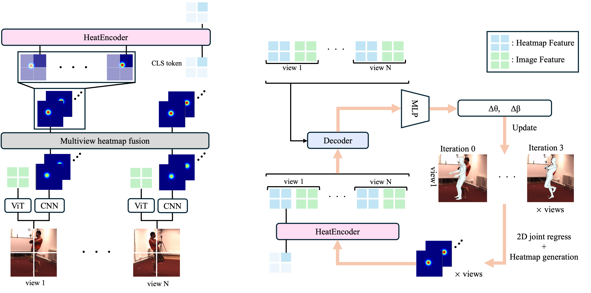

# HeatFormer: A Neural Optimizer for Multiview Human Mesh Recovery
This is the offical [Pytorch](https://pytorch.org/) implementation of the paper : 
[[arXive](https://arxiv.org/abs/2412.04456)] [[project page](https://vision.ist.i.kyoto-u.ac.jp/research/heatformer/)]




## Requirements

We tested our code with Python 3.8 on Ubuntu 20.04 LTS using the following packages.

Please refer to [environment/pip_freeze.txt](environment/pip_freeze.txt) for the specific versions we used.

You can also use `singularity` to replicate our environment:
```bash
singularity build environment/HeatFormer.sif environment/HeatFormer.def
singularity run --nv environment/HeatFormer.sif
```

# Data preparation
**SMPL**: You download SMPL layers from [here](https://smpl.is.tue.mpg.de/)(male&female) and [here](https://smplify.is.tue.mpg.de/)(neutral). You download adiitional data for SMPL from [here]() and place data like below:

```
${HeatFormer root}
|-- data
    |-- base_data
        |-- SMPL_MALE.pkl
        |-- SMPL_FEMALE.pkl
        |-- SMPL_NEUTRAL.pkl
        |-- J_regressor_body25.npy
        |-- J_regressor_extra.npy
        |-- J_regressor_h36m.npy
        |-- J_regressor_h36m_correct.npy
        |-- smpl_mean_params.npz
```

Dataset
1. [Human3.6M](http://vision.imar.ro/human3.6m/description.php)
2. [MPI-INF-3DHP](http://gvv.mpi-inf.mpg.de/3dhp-dataset/)
3. [BEHAVE](https://virtualhumans.mpi-inf.mpg.de/behave/)

Except for images, we provide preprocessed_data for all dataset.
You download from [Google Drive]() and place data following each dataset instruction.

More specifically:
1. **Human3.6M**: You regidter from this [link](http://vision.imar.ro/human3.6m/description.php) and download data. Then, you preprocess Human3.6M dataset by [H36M-Toolbox](https://github.com/CHUNYUWANG/H36M-Toolbox). After preprocessing data or download preprocedded data, you place data look like this:

```
${HeatFormer root}
|-- data
    |-- preprocessed_data
        |--h36m_train_25fps_new_db.pt
        |--h36m_test_25fps_new_db.pt
        |--h36m_train_25fps_ex_db.pt
        |--h36m_test_25fps_ex_db.pt
        |extra_data
            |-- Human36M_subject*_camera.json
            |-- Human36M_subject*_joint_3d.json
            |-- Human36M_subject*_SMPL_NeuralAnnot.json
    |-- dataset
        |-- images
            |-- s_01_act_02_subact_01_ca_01
            ..
```

2. **MPI-INF-3DHP**: You visit the [website](http://gvv.mpi-inf.mpg.de/3dhp-dataset/) of dataset, download zip file and, run the scripts. After running the scripts, you place the data look like this:

```
${HeatFormer root}
|-- data
    |-- preprocessed_data
        |-- mpii3d_train_scale12_new_db.pt
        |-- mpii3d_val_scale12_new_db.pt
        |-- mis_fit_mpii3d_train_sampling_5.pt
        |-- mis_fit_mpii3d_train_sampling_10.pt
        |-- j3d_mpi_db.pt
    |-- dataset
        |-- images_mpii3d
            |-- S*
                |Seq*
                    |-- video_*
                    |-- camera.calibration
```

3. **BEHAVE**: We use BEHAVE dataset for evaluation. You visit [BEHAVE](https://virtualhumans.mpi-inf.mpg.de/behave/) and download the data and put them like below:

```
${HeatFormer root}
|-- data
    |-- preprocessed_data
        |-- BEHAVE_train_db.pt
        |-- BEHAVE_valid_db.pt
|-- BEHAVE
    |-- sequences
    |-- calibs
```

# Training
Following **Data preparation**, download dataset and loading pretrain model including ViT from [Google Drive](), then start training using the following command:
```
Iteration : 3
python train.py --cfg asset/train_iter3.yaml --gpu 0

Iteration : 4
python train.py --cfg asset/train_iter4.yaml --gpu 0
```

# Evaluation
Download the dataset (Human3.6M, MPI-INF-3DHP, BEHAVE) and load pretrain models. Then run the following code for each dataset:

**Human3.6M**
```
Iteration : 3
python eval.py --cfg asset/eval_iter3.yaml --pretrain lib/models/pretrain/model_best_iter3.pth.tar --align_type pgt --dataset H36M --gpu 0

Iteration : 4
python eval.py --cfg asset/eval_iter4.yaml --pretrain lib/models/pretrain/model_best_iter4.pth.tar --align_type pgt --dataset H36M --gpu 0
```

**MPI-INF-3DHP**
```
Iteration : 3
python eval.py --cfg asset/eval_iter3.yaml --pretrain lib/models/pretrain/model_best_iter3.pth.tar --align_type pgt --dataset MPII3D --gpu 0

Iteration : 4
python eval.py --cfg asset/eval_iter4.yaml --pretrain lib/models/pretrain/model_best_iter4.pth.tar --align_type pgt --dataset MPII3D --gpu 0
```

**BEHAVE**
```
Iteration : 3
python eval_BEHAVE.py --cfg asset/eval_iter3.yaml --pretrain lib/models/pretrain/model_best_iter3.pth.tar --align_type pgt --score 0.3 --gpu 0

Iteration : 4
python eval_BEHAVE.py --cfg asset/eval_iter3.yaml --pretrain lib/models/pretrain/model_best_iter3.pth.tar --align_type pgt --score 0.3 --gpu 0
```

## Citing
Please cite the following paper, if you use any part of our code and data.

```
@InProceedings{Ymatsubara_2025_CVPR,
    author    = {Matsubara, Yuto and Nishino, Ko},
    title     = {HeatFormer: A Neural Optimizer for Multiview Human Mesh Recovery},
    booktitle = {Proceedings of the IEEE/CVF Conference on Computer Vision and Pattern Recognition (CVPR)},
    month     = {June},
    year      = {2025},
}
```